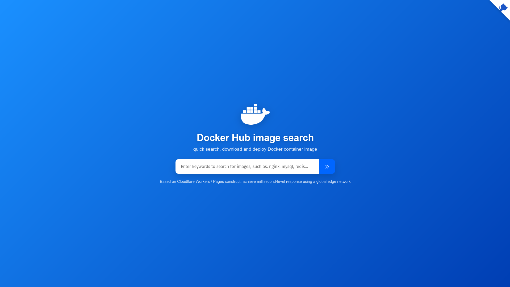

# 🐳 ابزاری برای راه اندازی پروکسی شخصی داکر!

این پروژه ابزاری هست برای راه اندازی پروکسی ایمیج های داکر بر بستر ورکر های کلاودفلر

> [!WARNING]
> توجه داشته باشید که راه اندازی وی پی ان و هرگونه پروکسی بر بستر کلاودفلر خلاف سیاست های استفاده از کلاودفر هست
> لطفا در هنگام استفاده به این مسئله توجه داشته باشید و این سرویس رو روی اکانت های اصلی خود راه اندازی نکنید


## 🚀 نحوه ی استقرار و پیاده سازی

- **Workers** ：محتویات فایل _workers.js رو توی ورکر پیاده سازی کنید
- **Pages** ：پروژه رو برای خودتون فورک کنید و با اتصال اکانت به کلادفلر به سادگی پیاده سازی کنید

## ⚙️ نحوه ی استفاده
فرض کنید دامنه ی اپ شما در ورکر این باشه：`myapp.account.workers.dev`；

### 1.دامنه ی ورکر خودتون رو به ابتدای اسم ایمیج اضافه کنید

```shell
docker pull myapp.account.workers.dev/grafana/grafana:12.0.1
```

```shell
docker pull docker.fxxk.dedyn.io/library/nginx:stable-alpine3.19-perl
```

### 2.تنظیم میرور در داکر

فایل `/etc/docker/daemon.json` رو در صورت موجود نبودن ایراد کنید و میررور خودتون رو اونجا ست کنید

```shell
sudo tee /etc/docker/daemon.json <<-'EOF'
{
  "registry-mirrors": ["https://myapp.account.workers.dev"]
}
EOF
sudo systemctl restart docker
```
